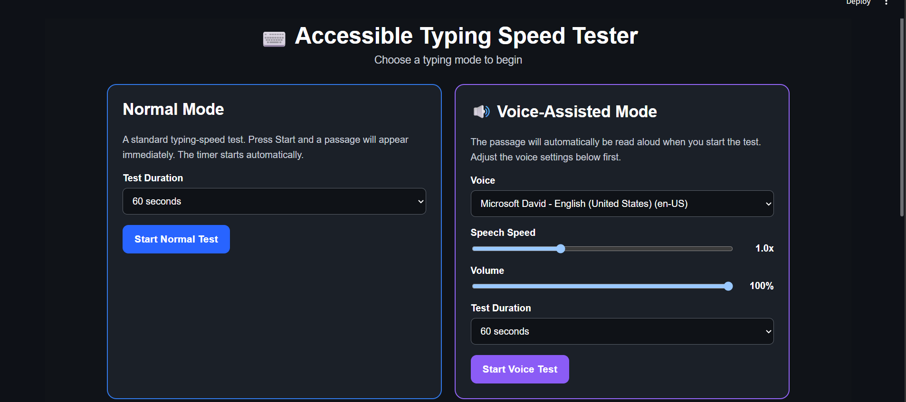
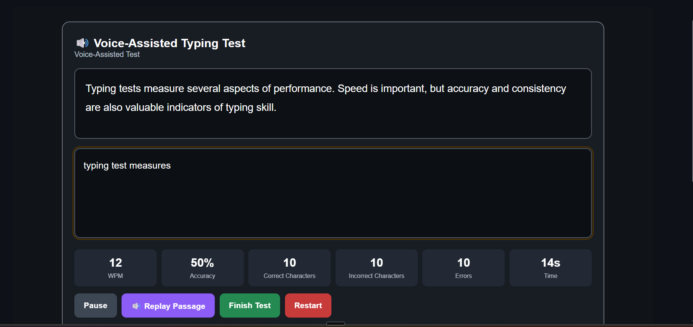
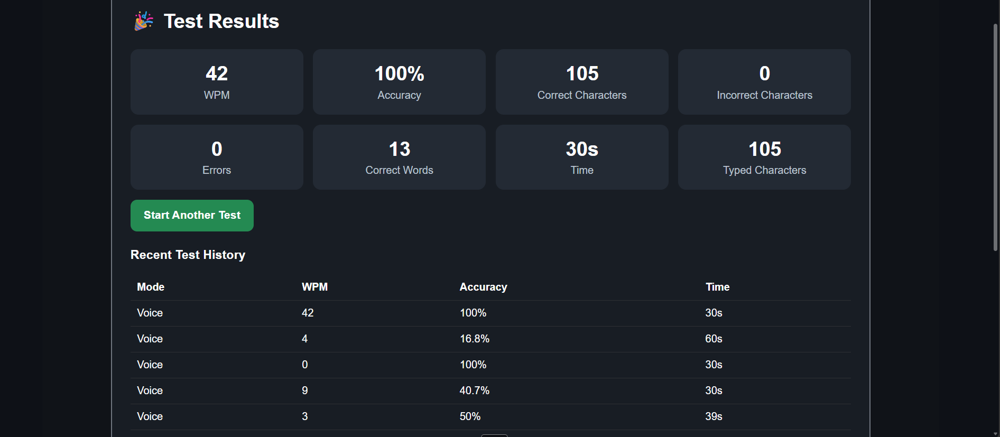

# Accessible Typing Speed Tester

An accessibility-focused typing speed testing application built with Python, Streamlit, HTML, CSS, and JavaScript.

The application provides two typing modes:

- Normal Mode
- Voice-Assisted Mode

## Features

### Normal Mode

- Standard typing speed test
- Random typing passages
- Automatic timer
- Real-time WPM calculation
- Accuracy calculation
- Correct characters
- Incorrect characters
- Error count
- Correct words
- Test completion time

### Voice-Assisted Mode

- Automatic passage reading
- Browser-based text-to-speech
- Adjustable speech speed
- Adjustable voice volume
- Selectable browser voices
- Replay passage functionality
- Accessibility-focused interface

## Accessibility Features

- High-contrast interface
- Large text
- Keyboard-friendly controls
- Voice-assisted testing
- Screen-reader-friendly status information
- Audio-first testing option

## Technologies Used

- Python
- Streamlit
- HTML
- CSS
- JavaScript
- Web Speech API

## Application Screenshots

### Home Screen

The opening interface provides two modes: Normal Mode and Voice-Assisted Mode.



### Typing Test

The typing interface displays the passage and provides real-time typing statistics such as WPM, accuracy, correct characters, incorrect characters, errors, and time.



### Results Screen

The results screen displays the user's final typing performance.



## How to Run

### 1. Clone the repository

```bash
git clone https://github.com/YOUR-USERNAME/accessible-typing-speed-tester.git
